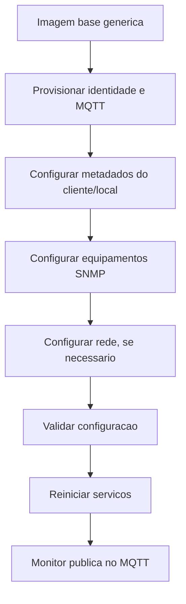

# Provisionamento de Telemetria Jupiter

Este documento explica como transformar uma imagem Jupiter generica em uma
telemetria configurada para um cliente, local e servidor MQTT especificos.

A ideia da imagem base e simples:

- ela nasce sem identidade de dispositivo;
- ela nao tem broker MQTT definido;
- ela nao tem cliente, local, VPN, IP fixo ou operadora LTE embutidos;
- ela so passa a conectar e publicar dados depois do provisionamento.



## 1. Arquivos principais

| Arquivo | Funcao | Quando muda |
| --- | --- | --- |
| `/etc/jupiter/device.json` | Identidade canonica do dispositivo | No provisionamento |
| `/home/proc/mqtt.json` | Host e porta do broker MQTT | No provisionamento |
| `/home/proc/secrets.env` | Senha MQTT | No provisionamento |
| `/etc/jupiter/fleet.json` | Cliente, site e metadados de frota | No provisionamento |
| `/home/proc/info.json` | Informacoes exibidas pela UI local | No provisionamento |
| `/home/proc/virtual_inputs.json` | Equipamentos e OIDs SNMP | No provisionamento ou pelo backend |
| `/etc/jupiter/network.json` | LAN, LTE, VPN e NAT | Somente se o destino precisar |
| `/etc/jupiter/telemetry.json` | Intervalo de coleta e caminhos dos arquivos | Normalmente fica igual |

Arquivos antigos que nao devem ser usados como fonte de configuracao:

- `/home/proc/device.json`
- `/home/proc/jupiter.json`
- `/etc/jupiter/mqtt.json`
- `/etc/jupiter/jupiter.json`

## 2. Dados necessarios antes de provisionar

Antes de configurar uma telemetria, separe estes dados:

| Dado | Exemplo |
| --- | --- |
| Device ID | `JUP-AFIPE-001` |
| Senha MQTT | `senha_mqtt_aqui` |
| Host MQTT | `mqtt.empresa.com.br` |
| Porta MQTT | `1883` |
| Cliente/Tenant | `afipe` |
| Site ID | `curitiba-pr` |
| Nome do site | `AFIPE Curitiba` |
| Equipamentos SNMP | IP, modelo, serial e OIDs |
| Rede local/VPN/LTE | Somente se necessario |

O `Device ID` tambem sera usado como:

- usuario MQTT;
- client ID MQTT;
- base de isolamento dos topicos MQTT.

## 3. Provisionamento rapido

Na placa, execute:

```sh
jupiter-provision DEVICE_ID MQTT_PASSWORD MQTT_HOST [MQTT_PORT] [TENANT] [SITE_ID] [SITE_NAME]
```

Exemplo:

```sh
jupiter-provision JUP-AFIPE-001 'senha_mqtt_aqui' mqtt.empresa.com.br 1883 afipe curitiba-pr "AFIPE Curitiba"
```

Esse comando grava:

- `/etc/jupiter/device.json`
- `/etc/jupiter/fleet.json`
- `/home/proc/info.json`
- `/home/proc/mqtt.json`
- `/home/proc/secrets.env`

Depois do comando, confira:

```sh
cat /etc/jupiter/device.json
cat /home/proc/mqtt.json
cat /etc/jupiter/fleet.json
test -f /home/proc/secrets.env && echo "segredo MQTT OK"
```

## 4. Configuracao dos equipamentos SNMP

O monitor le os equipamentos em:

```text
/home/proc/virtual_inputs.json
```

Exemplo minimo:

```json
{
  "site": "AFIPE Curitiba",
  "cliente": "afipe",
  "equipamentos": [
    {
      "ip": "192.168.1.50",
      "site_id": "curitiba-pr",
      "modelo": "Transmissor XPTO",
      "numero_de_serie": "TX123",
      "OIDS": [
        {
          "nome": "Potencia Direta",
          "topico": "potencia_direta",
          "oid": "1.3.6.1.4.1.x.x.x",
          "mascara": 0.1,
          "unidade": "W"
        },
        {
          "nome": "Status",
          "topico": "status",
          "oid": "1.3.6.1.4.1.x.x.y",
          "enum": {
            "0": "normal",
            "1": "falha"
          }
        }
      ]
    }
  ]
}
```

Campos do equipamento:

| Campo | Obrigatorio | Descricao |
| --- | --- | --- |
| `ip` | Sim | IP do equipamento SNMP |
| `site_id` | Nao | Identificador do local |
| `modelo` | Nao | Modelo ou nome do equipamento |
| `equipamento` | Nao | Alternativa ao campo `modelo` |
| `numero_de_serie` | Nao | Serial do equipamento |
| `OIDS` | Sim | Lista de OIDs a consultar |

Campos de cada OID:

| Campo | Obrigatorio | Descricao |
| --- | --- | --- |
| `oid` | Sim | OID SNMP a consultar |
| `topico` | Sim | Nome da metrica no payload MQTT |
| `nome` | Nao | Nome amigavel para UI |
| `mascara` | Nao | Multiplicador numerico aplicado ao valor |
| `unidade` | Nao | Unidade exibida na UI |
| `enum` | Nao | Mapa de valor numerico para status textual |

Depois de salvar o arquivo, valide o JSON:

```sh
jq empty /home/proc/virtual_inputs.json
```

Se `jq` nao estiver disponivel na placa, valide o arquivo antes de enviar para
ela.

## 5. Configuracao de rede

A imagem base vem com LAN, VPN, LTE e NAT desabilitados.

Arquivo:

```text
/etc/jupiter/network.json
```

### 5.1. LAN com IP fixo

Use somente se a telemetria precisar de IP fixo na rede local.

```json
{
  "lan": {
    "enabled": true,
    "interface": "eth0",
    "addresses": ["192.168.1.120/24"]
  }
}
```

O script `jupiter-network-init` converte o CIDR para netmask e aplica com
`ifconfig`.

### 5.2. VPN WireGuard

Use somente se o destino exigir VPN.

Crie o arquivo real da VPN:

```text
/etc/wireguard/wg0.conf
```

Depois habilite em `/etc/jupiter/network.json`:

```json
{
  "vpn": {
    "enabled": true,
    "interface": "wg0",
    "config_file": "/etc/wireguard/wg0.conf",
    "probe_host": "10.100.1.1"
  }
}
```

Observacoes:

- `probe_host` e opcional, mas ajuda a UI e os LEDs a validarem a VPN.
- A imagem base nao deve conter `PrivateKey`, `PublicKey`, `Endpoint` ou IPs
  de VPN de cliente.

### 5.3. LTE/PPP

Use somente se a telemetria for conectar por modem LTE.

A imagem traz arquivos de exemplo neutros:

```text
/etc/ppp/chat/jupiter-lte.example
/etc/ppp/peers/jupiter-lte.example
```

Crie os arquivos reais na placa:

```sh
cp /etc/ppp/chat/jupiter-lte.example /etc/ppp/chat/jupiter-lte
cp /etc/ppp/peers/jupiter-lte.example /etc/ppp/peers/jupiter-lte
```

Edite:

- APN em `/etc/ppp/chat/jupiter-lte`;
- usuario/senha da operadora em `/etc/ppp/peers/jupiter-lte`, se necessario;
- device do modem, normalmente `/dev/ttyUSB2`.

O arquivo `network.json` nao reescreve o peer PPP. O peer tambem precisa
apontar para o mesmo chat e para o mesmo device:

```text
connect "/usr/sbin/chat -v -f /etc/ppp/chat/jupiter-lte"

/dev/ttyUSB2
115200
```

Se o `network.json` declarar `chat_file` como `/etc/ppp/chat/DATATEM`, mas o
peer ainda tiver `connect ... /etc/ppp/chat/jupiter-lte`, o `pppd` vai usar o
caminho do peer. Nesse caso, o `jupiter-config-check lte-ready` deve falhar.

Depois habilite o LTE:

```json
{
  "lte": {
    "enabled": true,
    "peer": "jupiter-lte",
    "chat_file": "/etc/ppp/chat/jupiter-lte",
    "device": "/dev/ttyUSB2",
    "health_targets": ["8.8.8.8"],
    "check_interval_seconds": 60,
    "startup_wait_seconds": 30
  }
}
```

O watchdog LTE so inicia se `lte.enabled` estiver `true` e o peer existir.

### 5.4. NAT

Use somente quando a telemetria precisar rotear trafego entre interfaces.

```json
{
  "nat": {
    "enabled": true,
    "rules_file": "/etc/network/NAT/NAT.cfg"
  }
}
```

## 6. Validacao antes de iniciar

Rode:

```sh
jupiter-config-check
jupiter-config-check monitor-ready
jupiter-config-check lte-ready
```

Interpretacao:

| Comando | Esperado |
| --- | --- |
| `jupiter-config-check` | Pode mostrar warnings se algo opcional estiver vazio |
| `jupiter-config-check monitor-ready` | Retorno `0` quando MQTT/identidade estiverem prontos |
| `jupiter-config-check lte-ready` | Retorno `0` somente se LTE estiver habilitado e completo |

Para ver o codigo de retorno:

```sh
jupiter-config-check monitor-ready
echo $?
```

`0` significa pronto. Qualquer outro valor significa que ainda falta
configuracao.

## 7. Reiniciar servicos

Depois de provisionar e validar:

```sh
jupiter-services restart
```

O `jupiter-services` faz algumas protecoes:

- nao inicia o monitor se a identidade/MQTT estiverem incompletos;
- nao inicia o watchdog LTE se LTE nao estiver provisionado;
- mantem a UI local disponivel para ajuste e diagnostico.

## 8. Topicos MQTT usados pelo monitor

Com `device_id = JUP-AFIPE-001`, os topicos ficam:

```text
jupiter/JUP-AFIPE-001/telemetry
jupiter/JUP-AFIPE-001/status
jupiter/JUP-AFIPE-001/cmd
jupiter/JUP-AFIPE-001/config
```

O monitor publica telemetria em:

```text
jupiter/{device_id}/telemetry
```

E escuta comandos/configuracoes em:

```text
jupiter/{device_id}/cmd
jupiter/{device_id}/config
```

## 9. Logs uteis

| Log | Uso |
| --- | --- |
| `/var/log/jupiter/system.log` | Servicos, rede, provisionamento e estado geral |
| `/var/log/jupiter/monitor.log` | Conexao MQTT e loop do monitor |
| `/var/log/watchdog.log` | Estado do modem LTE |

Comandos uteis:

```sh
tail -f /var/log/jupiter/system.log
tail -f /var/log/jupiter/monitor.log
tail -f /var/log/watchdog.log
```

## 10. Checklist final de campo

Antes de enviar a telemetria para o destino, confirme:

- [ ] `device_id` preenchido em `/etc/jupiter/device.json`
- [ ] `status` de provisionamento como `provisioned`
- [ ] broker MQTT preenchido em `/home/proc/mqtt.json`
- [ ] senha MQTT presente em `/home/proc/secrets.env`
- [ ] cliente/site preenchidos em `/etc/jupiter/fleet.json`
- [ ] UI local com dados corretos em `/home/proc/info.json`
- [ ] equipamentos e OIDs em `/home/proc/virtual_inputs.json`
- [ ] `jupiter-config-check monitor-ready` retorna `0`
- [ ] rede configurada, se necessario
- [ ] VPN configurada, se necessario
- [ ] LTE configurado, se necessario
- [ ] `jupiter-services restart` executado
- [ ] telemetria chegando no broker MQTT

## 11. Observacao sobre recompilacao

Provisionar uma telemetria nao exige recompilar o monitor.

Recompile o binario `overlay/home/proc/monitor` somente quando houver mudanca no
codigo C em:

```text
dev/monitor.c
```

Depois de recompilar para a arquitetura da placa, substitua o binario no overlay
antes de gerar a nova imagem.
